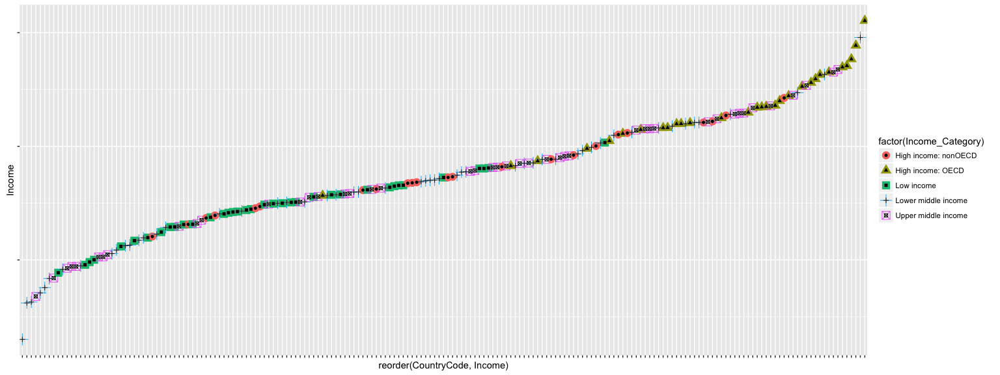

# 2016-0509 MSDS 6304-401 Case Study
Bill Kerneckel  
June 19, 2016  

<br>

#### Introduction


Gross Domestic Product (GDP) is the term used to by the workd to measure in dollars the values of goods and serivces produced by a country in a certain timeframe, usually by annual year. The GDP is the measurement used as a indicator to gauge the financial health and strength of the countries economy. In 2014, the World Bank collected 214 countries GPD. The economy coverage of this data spreads across the World, East Asia & Pacific, Europe & Central Asia, Latin America & Caribbean, Middle East & North Africa, South Asia, Sub Saharan Africa. The data includes high, middle, low incomes, and both Intertnational Development Association (IDA) and International Bank for Reconstruction and Development (IBRD) data. To view more details on this particular data set visit: <a href="http://data.worldbank.org/data-catalog/GDP-ranking-table" target="blank">The World Bank GDP Ranking</a>

Along with the GDP, The World Bank "EdStats All Indicator Query" holds around 3,000 internationally comparable indicators that describe education access, progression, completion, literacy, teachers, population, and expenditures. The indicators cover the education cycle from pre-primary to vocational and tertiary education. (source: <a href="http://http://data.worldbank.org/data-catalog/ed-stats">http://http://data.worldbank.org/data-catalog/ed-stats</a>)

In this study we will evaluate 190 ranked countries GPD and merge with education indicator data generated by the "EdStats All Indicator Query" to anwser the following questions:

1. Match the data based on the country shortcode. How many of the IDs match?
2. Sort the data frame in ascending order by GDP rank (so United States is last). What is the
13th country in the resulting data frame?
3. What are the average GDP rankings for the "High income: OECD" and "High income:
nonOECD" groups?
4. Plot the GDP for all of the countries. Use ggplot2 to color your plot by Income Group.
5. Cut the GDP ranking into 5 separate quantile groups. Make a table versus Income.Group.
How many countries are Lower middle income but among the 38 nations with highest
GDP?


****************************

#### Setting your working directory

In order for the analysis, tidying, and merging of two datasets you must set your working directory to the following:

`````
setwd("/Users/YOURUSERNAMESGOESHERE/desktop/CaseStudy/")
`````

****************************

#### Required Libraries for this Case Study

The libraries listed below must be installed in order for the functions outlined in the steps below to execute.


```r
library(downloader)
library(tidyr)
library(dplyr)
library(data.table)
library(RCurl)
library(ggplot2)
library(repmis)
library(scales)

cat("Success: All libaries downloaded")
```

```
## Success: All libaries downloaded
```

****************************

#### Data Gathering

Both datasets are downloaded from <a href="https://d396qusza40orc.cloudfront.net/" target="blank">Cloudfront.net</a>.


```r
download("https://d396qusza40orc.cloudfront.net/getdata%2Fdata%2FGDP.csv", destfile="GDP.csv")
download("https://d396qusza40orc.cloudfront.net/getdata%2Fdata%2FEDSTATS_Country.csv", destfile="FEDSTATS_Country.csv")

cat("Data downloaded into current working directory")
```

```
## Data downloaded into current working directory
```

****************************


#### Analysis of both data sets

Rough analysis of the datasets. The GDP.csv dataframe has 330 observations of 10 variables and the Fedstats_country.csv dataframe has 235 observations of 31 variables. Below are the details of both dataset:

GDP.csv


```r
gdp_data <- read.csv("GDP.csv", stringsAsFactors=FALSE, header=FALSE)
dim(gdp_data)
```

```
## [1] 331  10
```

```r
str(gdp_data)
```

```
## 'data.frame':	331 obs. of  10 variables:
##  $ V1 : chr  "" "" "" "" ...
##  $ V2 : chr  "Gross domestic product 2012" "" "" "Ranking" ...
##  $ V3 : logi  NA NA NA NA NA NA ...
##  $ V4 : chr  "" "" "" "Economy" ...
##  $ V5 : chr  "" "" "(millions of" "US dollars)" ...
##  $ V6 : chr  "" "" "" "" ...
##  $ V7 : logi  NA NA NA NA NA NA ...
##  $ V8 : logi  NA NA NA NA NA NA ...
##  $ V9 : logi  NA NA NA NA NA NA ...
##  $ V10: logi  NA NA NA NA NA NA ...
```

Fedstats_country.csv


```r
fedstats_data <- read.csv("Fedstats_country.csv", stringsAsFactors=FALSE, header=FALSE)
dim(fedstats_data)
```

```
## [1] 235  31
```

```r
str(fedstats_data)
```

```
## 'data.frame':	235 obs. of  31 variables:
##  $ V1 : chr  "CountryCode" "ABW" "ADO" "AFG" ...
##  $ V2 : chr  "Long Name" "Aruba" "Principality of Andorra" "Islamic State of Afghanistan" ...
##  $ V3 : chr  "Income Group" "High income: nonOECD" "High income: nonOECD" "Low income" ...
##  $ V4 : chr  "Region" "Latin America & Caribbean" "Europe & Central Asia" "South Asia" ...
##  $ V5 : chr  "Lending category" "" "" "IDA" ...
##  $ V6 : chr  "Other groups" "" "" "HIPC" ...
##  $ V7 : chr  "Currency Unit" "Aruban florin" "Euro" "Afghan afghani" ...
##  $ V8 : chr  "Latest population census" "2000" "Register based" "1979" ...
##  $ V9 : chr  "Latest household survey" "" "" "MICS, 2003" ...
##  $ V10: chr  "Special Notes" "" "" "Fiscal year end: March 20; reporting period for national accounts data: FY." ...
##  $ V11: chr  "National accounts base year" "1995" "" "2002/2003" ...
##  $ V12: chr  "National accounts reference year" "" "" "" ...
##  $ V13: chr  "System of National Accounts" "" "" "" ...
##  $ V14: chr  "SNA price valuation" "" "" "VAB" ...
##  $ V15: chr  "Alternative conversion factor" "" "" "" ...
##  $ V16: chr  "PPP survey year" "" "" "" ...
##  $ V17: chr  "Balance of Payments Manual in use" "" "" "" ...
##  $ V18: chr  "External debt Reporting status" "" "" "Actual" ...
##  $ V19: chr  "System of trade" "Special" "General" "General" ...
##  $ V20: chr  "Government Accounting concept" "" "" "Consolidated" ...
##  $ V21: chr  "IMF data dissemination standard" "" "" "GDDS" ...
##  $ V22: chr  "Source of most recent Income and expenditure data" "" "" "" ...
##  $ V23: chr  "Vital registration complete" "" "Yes" "" ...
##  $ V24: chr  "Latest agricultural census" "" "" "" ...
##  $ V25: chr  "Latest industrial data" "" "" "" ...
##  $ V26: chr  "Latest trade data" "2008" "2006" "2008" ...
##  $ V27: chr  "Latest water withdrawal data" "" "" "2000" ...
##  $ V28: chr  "2-alpha code" "AW" "AD" "AF" ...
##  $ V29: chr  "WB-2 code" "AW" "AD" "AF" ...
##  $ V30: chr  "Table Name" "Aruba" "Andorra" "Afghanistan" ...
##  $ V31: chr  "Short Name" "Aruba" "Andorra" "Afghanistan" ...
```

****************************


#### Tidy the data for GPD.csv data set

Here are the steps I have outlined to clean up the gross dosmestic product (GDP) data contained in the GDP.csv file. The steps below are required to merge the data:
<br>
<br>

<strong>Step 1:</strong> First we need to look at the first 10 records and last 10 records. This will help us understand what type of data exists in the data set.


```r
head(gdp_data,10)
```

```
##     V1                          V2 V3            V4           V5 V6 V7 V8
## 1      Gross domestic product 2012 NA                               NA NA
## 2                                  NA                               NA NA
## 3                                  NA               (millions of    NA NA
## 4                          Ranking NA       Economy  US dollars)    NA NA
## 5                                  NA                               NA NA
## 6  USA                           1 NA United States  16,244,600     NA NA
## 7  CHN                           2 NA         China   8,227,103     NA NA
## 8  JPN                           3 NA         Japan   5,959,718     NA NA
## 9  DEU                           4 NA       Germany   3,428,131     NA NA
## 10 FRA                           5 NA        France   2,612,878     NA NA
##    V9 V10
## 1  NA  NA
## 2  NA  NA
## 3  NA  NA
## 4  NA  NA
## 5  NA  NA
## 6  NA  NA
## 7  NA  NA
## 8  NA  NA
## 9  NA  NA
## 10 NA  NA
```

```r
tail(gdp_data,10)
```

```
##     V1 V2 V3 V4 V5 V6 V7 V8 V9 V10
## 322       NA          NA NA NA  NA
## 323       NA          NA NA NA  NA
## 324       NA          NA NA NA  NA
## 325       NA          NA NA NA  NA
## 326       NA          NA NA NA  NA
## 327       NA          NA NA NA  NA
## 328       NA          NA NA NA  NA
## 329       NA          NA NA NA  NA
## 330       NA          NA NA NA  NA
## 331       NA          NA NA NA  NA
```

<br>

<strong>Step 2:</strong> So the data is actually between rows 5 and 330. Since the assignment states we will only be looking at the 190 countries we can omit and data greater than 190. So lets set the rows between 5 and 194. You may be asking the question why I didn't I set the rows to 190. Well we need to account for extra rows added in the heading off the data file.


```r
gpd_data <- gdp_data[6:195,]
```
<br>

<strong>Step 3:</strong> Notice all the 'NA's in the data set? Let's count how many there are before we remove them. From the output below there are a count of 331 NA's in each of the following columns: V3, V7, V8, V9, V10. If we add the numbers we have a total of 1,655 NAs in the GDP.csv dataset.


```r
na_count <-sapply(gdp_data, function(y) sum(length(which(is.na(y)))))
na_count <- data.frame(na_count)
na_count
```

```
##     na_count
## V1         0
## V2         0
## V3       331
## V4         0
## V5         0
## V6         0
## V7       331
## V8       331
## V9       331
## V10      331
```

<br>

<strong>Step 4:</strong> Now we need to remove the columns that have contain all "NA"s.


```r
na_removed <- gpd_data[,-which(apply(gpd_data,2,function(x)all(is.na(x))))]
```

<br>
<strong>Step 5:</strong> The data is getting more tidy, but I see one extra column we need to take care of. Notice the last column V6, let's see what data exists in the column before we decide what to do with it.


```r
levels(na_removed$V6)
```

```
## NULL
```

```r
occurances <- table(gpd_data$V6)
occurances
```

```
## 
##       a   b   c   d   e   f 
## 184   1   1   1   1   1   1
```

<br>

<strong>Step 6:</strong> The data in the V6 column does not appear to be useful so lets go ahead and remove the column from the dataset.


```r
na_removed$V6 <- NULL
clean_gdp_data <- na_removed
```

<br>

<strong>Step 7:</strong> Now we can rename the column headings to describe the data contain in each column. An important note here is the first column has to be renamed to the exact name as the first #column in the Fedstats_country.csv dataset. This is the column we will be merging with.


```r
setnames(clean_gdp_data, old=c("V1","V2","V4","V5"), new=c("CountryCode","Ranking","Country","Income"))
```

<br>

<strong>Step 8:</strong> We need to remove all commas "," from the numeric values in Income column.


```r
clean_gdp_data$Income <- gsub(",", "", clean_gdp_data$Income)
```

<br>
<strong>Step 9:</strong> We are almost finished with the tidying. We need to change the column type for the Ranking and Income columns from character to interger.


```r
clean_gdp_data$Income <- as.integer(clean_gdp_data$Income)
clean_gdp_data$Ranking <- as.integer(clean_gdp_data$Ranking)
```

Ok, finally we now have a tidy dataset for the GDP.csv. Remember this variable, <strong>clean_gdp_data</strong>, we will be using it later when we merge the data together. Next step is to tidy the next data set contained in the Fedstas_country.csv file.
<br>

****************************

#### Tidy the Data for Fedstats_country.csv data set

On to the next data set. Like the previous 9 steps above, I have again outlined steps below to clean up the data contained in the Fedstats_country.csv file. These steps are required in order to merge the data:
<br>
<br>

<strong>Step 1:</strong> First let's clean it up a bit and look at the first 52 records and last 2 records. This will help understand what type of data we are dealing with.


```r
head(fedstats_data,2)
```

```
##            V1        V2                   V3                        V4
## 1 CountryCode Long Name         Income Group                    Region
## 2         ABW     Aruba High income: nonOECD Latin America & Caribbean
##                 V5           V6            V7                       V8
## 1 Lending category Other groups Currency Unit Latest population census
## 2                               Aruban florin                     2000
##                        V9           V10                         V11
## 1 Latest household survey Special Notes National accounts base year
## 2                                                              1995
##                                V12                         V13
## 1 National accounts reference year System of National Accounts
## 2                                                             
##                   V14                           V15             V16
## 1 SNA price valuation Alternative conversion factor PPP survey year
## 2                                                                  
##                                 V17                            V18
## 1 Balance of Payments Manual in use External debt Reporting status
## 2                                                                 
##               V19                           V20
## 1 System of trade Government Accounting concept
## 2         Special                              
##                               V21
## 1 IMF data dissemination standard
## 2                                
##                                                 V22
## 1 Source of most recent Income and expenditure data
## 2                                                  
##                           V23                        V24
## 1 Vital registration complete Latest agricultural census
## 2                                                       
##                      V25               V26                          V27
## 1 Latest industrial data Latest trade data Latest water withdrawal data
## 2                                     2008                             
##            V28       V29        V30        V31
## 1 2-alpha code WB-2 code Table Name Short Name
## 2           AW        AW      Aruba      Aruba
```

```r
tail(fedstats_data,2)
```

```
##      V1                   V2         V3                 V4    V5   V6
## 234 ZMB   Republic of Zambia Low income Sub-Saharan Africa   IDA HIPC
## 235 ZWE Republic of Zimbabwe Low income Sub-Saharan Africa Blend     
##                  V7   V8           V9
## 234  Zambian kwacha 2000    DHS, 2007
## 235 Zimbabwe dollar 2002 DHS, 2005/06
##                                                                            V10
## 234                                                                           
## 235 Fiscal year end: June 30; reporting period for national accounts data: CY.
##      V11 V12 V13 V14        V15  V16  V17         V18     V19          V20
## 234 1994         VAB    1990-92 2005 BPM5 Preliminary General    Budgetary
## 235 1990         VAB 1991, 1998 2005 BPM5      Actual General Consolidated
##      V21          V22 V23  V24  V25  V26  V27 V28 V29      V30      V31
## 234 GDDS IHS, 2004-05     1990      2008 2000  ZM  ZM   Zambia   Zambia
## 235 GDDS                  1960 1995 2008 2002  ZW  ZW Zimbabwe Zimbabwe
```
<br>

<strong>Step 2:</strong> So the data is actually starts on the 2 row. Let's go ahead and grab the data that we need.


```r
fedstats_data <- fedstats_data[2:235,]
```
<br>

<strong>Step 3:</strong> Wow, there is a lot of columns with data we don’t need. Lets focus only focus on the columns we need so lets keep those.


```r
keep <- c("V1","V3")
clean_fedstats_data = fedstats_data[keep]
```
<br>

<strong>Step 4:</strong> Now lets remove the rows that contain blank values "Income.Group" column


```r
clean_fedstats_data <- subset(clean_fedstats_data, V3 != "")
```
<br>
<strong>Step 5:</strong> The data is almost tidy, but we have one last step, need to rename the column headings to words that describe the data in each of the columns.


```r
setnames(clean_fedstats_data, old=c("V1","V3"), new=c("CountryCode","Income_Category"))
```

<br>
Ok, finally we now have a tidy dataset for the Fedstats_country.csv. The variable name we ended up calling the tidy data for this dataset is called <strong>"clean_fedstats_data"</strong>. Now that we have both of our datasets tidy we can merge them together.
<br>

****************************

#### Merging the Data

Merging datasets in the two files together is tricky. We can only hope for a "one to one" relationship in the datasets so the merging goes smoothly. In this example, we want to merge the data from the combined datasets so the tidy data in the GDP country ranking data contained in the GPD.csv file is merged with the tidy data from the country code and education catagory data contained in the Fedstats_country.csv file. The column we want to merge on is the CountryCode column in both .CSV files.
<br>

<strong>Merge Data</strong>

```r
merged_data <- merge(clean_gdp_data, clean_fedstats_data, by="CountryCode", all=TRUE)
```

Now that we have merged the two datasets together lets take a look at we accomplished.


```r
str(merged_data)
```

```
## 'data.frame':	211 obs. of  5 variables:
##  $ CountryCode    : chr  "ABW" "ADO" "AFG" "AGO" ...
##  $ Ranking        : int  161 NA 105 60 125 32 26 133 NA 172 ...
##  $ Country        : chr  "Aruba" NA "Afghanistan" "Angola" ...
##  $ Income         : int  2584 NA 20497 114147 12648 348595 475502 9951 NA 1134 ...
##  $ Income_Category: chr  "High income: nonOECD" "High income: nonOECD" "Low income" "Lower middle income" ...
```

Clearly we still have some more cleaning up to do. We need to remove all rows that contain blanks and NAs values in the columns.


```r
blanked_removed <- subset(merged_data, Income_Category != "")
na_removed <- subset(blanked_removed, Income != "NA")
```

Yahoo!!!! We have a clean merging of data. To conserve page real estate lets just ouptut the first 5 and last 5 records of the merged data.


```r
clean_merged_data <- na_removed
head(clean_merged_data,5)
```

```
##   CountryCode Ranking              Country Income      Income_Category
## 1         ABW     161                Aruba   2584 High income: nonOECD
## 3         AFG     105          Afghanistan  20497           Low income
## 4         AGO      60               Angola 114147  Lower middle income
## 5         ALB     125              Albania  12648  Upper middle income
## 6         ARE      32 United Arab Emirates 348595 High income: nonOECD
```

```r
tail(clean_merged_data,5)
```

```
##     CountryCode Ranking          Country Income     Income_Category
## 207         YEM      90      Yemen, Rep.  35646 Lower middle income
## 208         ZAF      28     South Africa 384313 Upper middle income
## 209         ZAR     112 Congo, Dem. Rep.  17204          Low income
## 210         ZMB     104           Zambia  20678          Low income
## 211         ZWE     134         Zimbabwe   9802          Low income
```
****************************

#### Case Study Questions and Anwsers

<strong>Question 1.</strong> Match the data based on the country shortcode. How many of the IDs match? Before the merge of the two datasets we had 190 observations in the GPD.csv file. In the Fedstats_country.csv file we had a total of 211 observations.<strong>When we tidy up the data (removed the columns, NA's, blanks values in the datasets and merged on the country shortcake 189 observations matched.</strong>

<br>

<strong>Question 2.</strong> Sort the data frame in ascending order by GDP rank (so United States is last). What is the
13th country in the resulting data frame?


```r
arranged_data <- arrange(clean_merged_data, desc(Ranking))
thirteenthcountry <- arranged_data[13,]
thirteenthcountry
```

```
##    CountryCode Ranking             Country Income     Income_Category
## 13         KNA     178 St. Kitts and Nevis    767 Upper middle income
```
<br>

<strong>Question 3.</strong> What are the average GDP rankings for the "High income: OECD" and "High income:
nonOECD" groups?

Let's first arrange the data by Income Category


```r
arranged_by_category_data <- arrange(clean_merged_data, desc(Income_Category))
```

If we look at the starting rows and ending rows for the High income: OECD and High income: nonOECD groups in the "arranged_by_category_data" we can look at the summary to calculate the average of the ratings.


```r
High_Income_OECD <- arranged_by_category_data[137:166,]
summary(High_Income_OECD)
```

```
##  CountryCode           Ranking         Country              Income        
##  Length:30          Min.   :  1.00   Length:30          Min.   :   13579  
##  Class :character   1st Qu.: 12.25   Class :character   1st Qu.:  211147  
##  Mode  :character   Median : 24.50   Mode  :character   Median :  486528  
##                     Mean   : 32.97                      Mean   : 1483917  
##                     3rd Qu.: 45.75                      3rd Qu.: 1480047  
##                     Max.   :122.00                      Max.   :16244600  
##  Income_Category   
##  Length:30         
##  Class :character  
##  Mode  :character  
##                    
##                    
## 
```

The average ranking for the High income: OECD is <strong>32.97</strong>


```r
High_Income_NonOECD <- arranged_by_category_data[167:189,]
summary(High_Income_NonOECD)
```

```
##  CountryCode           Ranking         Country              Income      
##  Length:23          Min.   : 19.00   Length:23          Min.   :  2584  
##  Class :character   1st Qu.: 58.50   Class :character   1st Qu.: 12838  
##  Mode  :character   Median : 94.00   Mode  :character   Median : 28373  
##                     Mean   : 91.91                      Mean   :104350  
##                     3rd Qu.:125.00                      3rd Qu.:131204  
##                     Max.   :161.00                      Max.   :711050  
##  Income_Category   
##  Length:23         
##  Class :character  
##  Mode  :character  
##                    
##                    
## 
```

The average ranking for the High income: nonOECD is <strong>91.91</strong>

<br>

<strong>Question 4.</strong> Plot the GDP for all of the countries. Use ggplot2 to color your plot by Income Group.

<!-- -->

<br>

<strong>Question 5.</strong> Cut the GDP ranking into 5 separate quantile groups. Make a table versus Income.Group.


Ranking quantiles by applying the summary function.

```r
summary(arranged_by_category_data)
```

```
##  CountryCode           Ranking         Country              Income        
##  Length:189         Min.   :  1.00   Length:189         Min.   :      40  
##  Class :character   1st Qu.: 48.00   Class :character   1st Qu.:    6972  
##  Mode  :character   Median : 95.00   Mode  :character   Median :   28242  
##                     Mean   : 95.31                      Mean   :  379597  
##                     3rd Qu.:143.00                      3rd Qu.:  205789  
##                     Max.   :190.00                      Max.   :16244600  
##  Income_Category   
##  Length:189        
##  Class :character  
##  Mode  :character  
##                    
##                    
## 
```

The quantiles are: <strong>1, 48, 95.31, 143, 190</strong>

<br>

<strong>1st Quantile (Low Income)</strong>

Now let's evaluate the data that exists in the first quantile (Low Income).


```r
FirstQuantile <- arranged_by_category_data[100:134,]
```

Grab the data from the columns we are only interested in.


```r
FirstQuantile2 <- FirstQuantile[ c("CountryCode", "Ranking", "Income_Category")]
```

Finally, we can sort the data in decending order by Income_Category.


```r
FirstQuantileIncome <- arrange(FirstQuantile2, desc(Income_Category))
FirstQuantileIncome
```

```
##    CountryCode Ranking Income_Category
## 1          AFG     105      Low income
## 2          BDI     162      Low income
## 3          BEN     140      Low income
## 4          BFA     128      Low income
## 5          BGD      59      Low income
## 6          CAF     165      Low income
## 7          COM     182      Low income
## 8          ERI     159      Low income
## 9          ETH      85      Low income
## 10         GHA      86      Low income
## 11         GIN     148      Low income
## 12         GMB     175      Low income
## 13         GNB     176      Low income
## 14         HTI     139      Low income
## 15         KEN      87      Low income
## 16         KGZ     145      Low income
## 17         KHM     120      Low income
## 18         LAO     136      Low income
## 19         LBR     168      Low income
## 20         MDG     132      Low income
## 21         MLI     129      Low income
## 22         MOZ     118      Low income
## 23         MRT     154      Low income
## 24         MWI     152      Low income
## 25         NER     144      Low income
## 26         NPL     107      Low income
## 27         RWA     142      Low income
## 28         SLB     174      Low income
## 29         SLE     157      Low income
## 30         TCD     124      Low income
## 31         TGO     156      Low income
## 32         TJK     143      Low income
## 33         TZA      95      Low income
## 34         UGA     106      Low income
## 35         ZAR     112      Low income
```

<br>

<strong>2nd Quantile (Lower Middle Income)</strong>

We will repeat the same data tidying metohds for the remaining qauntiles


```r
SecondQuantile <- arranged_by_category_data[46:99,]

SecondQuantile2 <- SecondQuantile[c("CountryCode", "Ranking", "Income_Category")]

SecondQuantileIncome <- arrange(SecondQuantile2, desc(Income_Category))
SecondQuantileIncome
```

```
##    CountryCode Ranking     Income_Category
## 1          AGO      60 Lower middle income
## 2          ARM     133 Lower middle income
## 3          BLZ     169 Lower middle income
## 4          BOL      96 Lower middle income
## 5          BTN     167 Lower middle income
## 6          CHN       2 Lower middle income
## 7          CIV      99 Lower middle income
## 8          CMR      98 Lower middle income
## 9          COG     121 Lower middle income
## 10         CPV     166 Lower middle income
## 11         ECU      64 Lower middle income
## 12         EGY      38 Lower middle income
## 13         FSM     185 Lower middle income
## 14         GEO     114 Lower middle income
## 15         GTM      77 Lower middle income
## 16         GUY     160 Lower middle income
## 17         HND     108 Lower middle income
## 18         IDN      16 Lower middle income
## 19         IND      10 Lower middle income
## 20         IRQ      47 Lower middle income
## 21         JOR      92 Lower middle income
## 22         KIR     189 Lower middle income
## 23         KSV     146 Lower middle income
## 24         LKA      70 Lower middle income
## 25         LSO     163 Lower middle income
## 26         MAR      62 Lower middle income
## 27         MDA     141 Lower middle income
## 28         MDV     164 Lower middle income
## 29         MHL     188 Lower middle income
## 30         MNG     130 Lower middle income
## 31         NGA      39 Lower middle income
## 32         NIC     126 Lower middle income
## 33         PAK      44 Lower middle income
## 34         PHL      41 Lower middle income
## 35         PNG     115 Lower middle income
## 36         PRY      97 Lower middle income
## 37         SDN      73 Lower middle income
## 38         SEN     119 Lower middle income
## 39         SLV     100 Lower middle income
## 40         STP     186 Lower middle income
## 41         SWZ     158 Lower middle income
## 42         SYR      65 Lower middle income
## 43         THA      31 Lower middle income
## 44         TKM      91 Lower middle income
## 45         TMP     170 Lower middle income
## 46         TON     184 Lower middle income
## 47         TUN      79 Lower middle income
## 48         TUV     190 Lower middle income
## 49         UKR      53 Lower middle income
## 50         UZB      75 Lower middle income
## 51         VNM      57 Lower middle income
## 52         VUT     177 Lower middle income
## 53         WSM     181 Lower middle income
## 54         YEM      90 Lower middle income
```

<br>

<strong>3rd Quantile (Upper Middle Income)</strong>


```r
ThirdQuantile <- arranged_by_category_data[1:45,]

ThirdQuantile2 <- ThirdQuantile[c("CountryCode", "Ranking", "Income_Category")] 

ThirdQuantileIncome <- arrange(ThirdQuantile2, desc(Income_Category))
ThirdQuantileIncome
```

```
##    CountryCode Ranking     Income_Category
## 1          ALB     125 Upper middle income
## 2          ARG      26 Upper middle income
## 3          ATG     172 Upper middle income
## 4          AZE      68 Upper middle income
## 5          BGR      76 Upper middle income
## 6          BIH     111 Upper middle income
## 7          BLR      69 Upper middle income
## 8          BRA       7 Upper middle income
## 9          BWA     117 Upper middle income
## 10         CHL      36 Upper middle income
## 11         COL      30 Upper middle income
## 12         CRI      81 Upper middle income
## 13         CUB      67 Upper middle income
## 14         DMA     183 Upper middle income
## 15         DOM      72 Upper middle income
## 16         DZA      48 Upper middle income
## 17         FJI     155 Upper middle income
## 18         GAB     109 Upper middle income
## 19         GRD     178 Upper middle income
## 20         IRN      22 Upper middle income
## 21         JAM     116 Upper middle income
## 22         KAZ      50 Upper middle income
## 23         KNA     178 Upper middle income
## 24         LBN      83 Upper middle income
## 25         LCA     171 Upper middle income
## 26         LTU      84 Upper middle income
## 27         MEX      14 Upper middle income
## 28         MKD     135 Upper middle income
## 29         MNE     151 Upper middle income
## 30         MUS     127 Upper middle income
## 31         MYS      34 Upper middle income
## 32         NAM     123 Upper middle income
## 33         PAN      89 Upper middle income
## 34         PER      49 Upper middle income
## 35         PLW     187 Upper middle income
## 36         ROM      52 Upper middle income
## 37         RUS       8 Upper middle income
## 38         SRB      88 Upper middle income
## 39         SUR     150 Upper middle income
## 40         SYC     173 Upper middle income
## 41         TUR      17 Upper middle income
## 42         URY      78 Upper middle income
## 43         VCT     180 Upper middle income
## 44         VEN      29 Upper middle income
## 45         ZAF      28 Upper middle income
```

<br>

<strong>4th Quantile (High Income: nonOECD)</strong>


```r
FourthQuantile <- arranged_by_category_data[167:189, ]

FourthQuantile2 <- FourthQuantile[c("CountryCode", "Ranking", "Income_Category")]

FourthQuantileIncome <- arrange(FourthQuantile2, desc(Income_Category))
FourthQuantileIncome
```

```
##    CountryCode Ranking      Income_Category
## 1          ABW     161 High income: nonOECD
## 2          ARE      32 High income: nonOECD
## 3          BHR      93 High income: nonOECD
## 4          BHS     138 High income: nonOECD
## 5          BMU     149 High income: nonOECD
## 6          BRB     153 High income: nonOECD
## 7          BRN     113 High income: nonOECD
## 8          CYP     102 High income: nonOECD
## 9          EST     103 High income: nonOECD
## 10         GNQ     110 High income: nonOECD
## 11         HKG      37 High income: nonOECD
## 12         HRV      71 High income: nonOECD
## 13         KWT      56 High income: nonOECD
## 14         LVA      94 High income: nonOECD
## 15         MAC      82 High income: nonOECD
## 16         MCO     147 High income: nonOECD
## 17         MLT     137 High income: nonOECD
## 18         OMN      66 High income: nonOECD
## 19         PRI      61 High income: nonOECD
## 20         QAT      54 High income: nonOECD
## 21         SAU      19 High income: nonOECD
## 22         SGP      35 High income: nonOECD
## 23         TTO     101 High income: nonOECD
```

<br>

<strong>5th Quantile (High Income: OECD)</strong>


```r
FifthQuantile <- arranged_by_category_data[137:166, ]

FifthQuantile2 <- FifthQuantile[c("CountryCode", "Ranking", "Income_Category")]

FifthQuantileIncome <- arrange(FifthQuantile2, desc(Income_Category)) 
FifthQuantileIncome
```

```
##    CountryCode Ranking   Income_Category
## 1          AUS      12 High income: OECD
## 2          AUT      27 High income: OECD
## 3          BEL      25 High income: OECD
## 4          CAN      11 High income: OECD
## 5          CHE      20 High income: OECD
## 6          CZE      51 High income: OECD
## 7          DEU       4 High income: OECD
## 8          DNK      33 High income: OECD
## 9          ESP      13 High income: OECD
## 10         FIN      43 High income: OECD
## 11         FRA       5 High income: OECD
## 12         GBR       6 High income: OECD
## 13         GRC      42 High income: OECD
## 14         HUN      58 High income: OECD
## 15         IRL      46 High income: OECD
## 16         ISL     122 High income: OECD
## 17         ISR      40 High income: OECD
## 18         ITA       9 High income: OECD
## 19         JPN       3 High income: OECD
## 20         KOR      15 High income: OECD
## 21         LUX      74 High income: OECD
## 22         NLD      18 High income: OECD
## 23         NOR      23 High income: OECD
## 24         NZL      55 High income: OECD
## 25         POL      24 High income: OECD
## 26         PRT      45 High income: OECD
## 27         SVK      63 High income: OECD
## 28         SVN      80 High income: OECD
## 29         SWE      21 High income: OECD
## 30         USA       1 High income: OECD
```

How many countries are lower middle income but have the top 38 highest GDP? <strong>49 countries have lower middle income but have the top 38 highest GDP. </strong>


```r
SecondQuantileIncome_Arranged <- arrange(SecondQuantileIncome, desc(Ranking))
SecondQuantileIncome_Arranged[1:49,]
```

```
##    CountryCode Ranking     Income_Category
## 1          TUV     190 Lower middle income
## 2          KIR     189 Lower middle income
## 3          MHL     188 Lower middle income
## 4          STP     186 Lower middle income
## 5          FSM     185 Lower middle income
## 6          TON     184 Lower middle income
## 7          WSM     181 Lower middle income
## 8          VUT     177 Lower middle income
## 9          TMP     170 Lower middle income
## 10         BLZ     169 Lower middle income
## 11         BTN     167 Lower middle income
## 12         CPV     166 Lower middle income
## 13         MDV     164 Lower middle income
## 14         LSO     163 Lower middle income
## 15         GUY     160 Lower middle income
## 16         SWZ     158 Lower middle income
## 17         KSV     146 Lower middle income
## 18         MDA     141 Lower middle income
## 19         ARM     133 Lower middle income
## 20         MNG     130 Lower middle income
## 21         NIC     126 Lower middle income
## 22         COG     121 Lower middle income
## 23         SEN     119 Lower middle income
## 24         PNG     115 Lower middle income
## 25         GEO     114 Lower middle income
## 26         HND     108 Lower middle income
## 27         SLV     100 Lower middle income
## 28         CIV      99 Lower middle income
## 29         CMR      98 Lower middle income
## 30         PRY      97 Lower middle income
## 31         BOL      96 Lower middle income
## 32         JOR      92 Lower middle income
## 33         TKM      91 Lower middle income
## 34         YEM      90 Lower middle income
## 35         TUN      79 Lower middle income
## 36         GTM      77 Lower middle income
## 37         UZB      75 Lower middle income
## 38         SDN      73 Lower middle income
## 39         LKA      70 Lower middle income
## 40         SYR      65 Lower middle income
## 41         ECU      64 Lower middle income
## 42         MAR      62 Lower middle income
## 43         AGO      60 Lower middle income
## 44         VNM      57 Lower middle income
## 45         UKR      53 Lower middle income
## 46         IRQ      47 Lower middle income
## 47         PAK      44 Lower middle income
## 48         PHL      41 Lower middle income
## 49         NGA      39 Lower middle income
```

Look at the "Lower Middle Income" entries and see which ones exist below the 38th GDP ranking. <strong>4 countries exist below the 38th GDP Ranking.</strong>


```r
SecondQuantileIncome_Arranged[51:54,]
```

```
##    CountryCode Ranking     Income_Category
## 51         THA      31 Lower middle income
## 52         IDN      16 Lower middle income
## 53         IND      10 Lower middle income
## 54         CHN       2 Lower middle income
```


****************************

#### Conclusion and Summary

In summary we downloaded, analyzed, tidy, and merged two .CSV files into one dataset. In order to merge the two files we first had to tidy the data in each dataset by removing unnecessary columns, removing NA and blank values, renaming column headings, and changing column types from factors to integers. As a result, before the merge of the data in the GPD.csv dataset we ended up with 189 records with 3 columns. In the Fedstats_country.csv the data frame has 235 observations of 31 variables. After we merged the dataset together and tidy up the data we ended up with 189 records. When we plotted the merged data we can clearly linear trend from lowest to highest GPD incomes. Clearly, the United States by far has the strongest GDP amoungst all the countries represented in the merged dataset. 


****************************

#### Acknowledgements

As per the terms of use on <a href="http://data.worldbank.org/summary-terms-of-use" target="blank">The World Bank GDP Ranking</a> I am acknowledging the source of the data in order to be able to freely use it.

